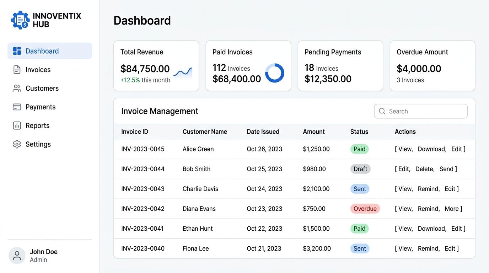
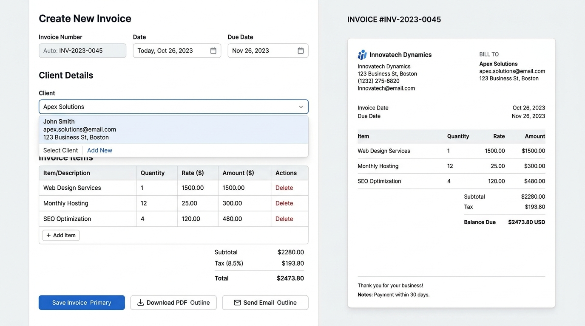
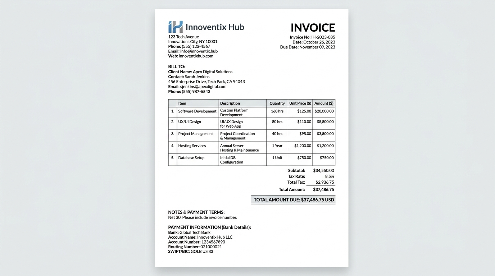

# 📄 Innoventix Hub - Invoice Generator

A modern, full-stack Invoice Generator application built with **Next.js**, **TypeScript**, **Tailwind CSS**, **Supabase**, and **Nodemailer**. Designed for seamless client management, dynamic line item calculations, email delivery, and clean, isolated browser print/PDF export without serverless browser binary dependencies.

---

## 📸 Output Screenshots

### 1. Dashboard Overview
Comprehensive dashboard displaying revenue metrics, invoice statistics, payment statuses, and quick action controls.


### 2. Live Invoice Builder (`/create-invoice`)
Dynamic invoice creation suite with real-time tax/total calculation, line items manager, client selector, and live side-by-side invoice preview.


### 3. Isolated Printable Invoice View (`/invoice/[id]`)
Dedicated standalone invoice view equipped with auto-print triggers and `@media print` styling to export clean, branded PDF receipts without UI clutter.


---

## ✨ Features

- **📊 Financial Analytics Dashboard**: Real-time summary of total revenue, paid invoices, pending payments, and overdue amounts.
- **📄 Dynamic Invoice Builder**: Live client selection, auto due date calculation, itemized line items table, and instant preview.
- **🖨️ Serverless-Safe PDF Export**: Dedicated standalone print view (`/invoice/[id]?print=true`) with `@media print` CSS rules hiding all navigation and sidebars.
- **✉️ Automated Email Delivery**: Send invoices directly to clients via Gmail SMTP (Nodemailer) with formatted HTML email bodies.
- **⚡ Supabase Integration**: Persistence for client records, invoice metadata, line items, and payment status updates.

---

## 🚀 Getting Started

### 1. Install Dependencies
```bash
npm install
```

### 2. Configure Environment Variables
Create a `.env.local` file in the project root:
```env
NEXT_PUBLIC_SUPABASE_URL=your_supabase_url
NEXT_PUBLIC_SUPABASE_ANON_KEY=your_supabase_anon_key
GMAIL_USER=your_email@gmail.com
GMAIL_APP_PASSWORD=your_gmail_app_password
```

### 3. Run Development Server
```bash
npm run dev
```
Open [http://localhost:3000](http://localhost:3000) in your browser.

---

## 🛠️ Tech Stack

- **Framework**: Next.js 16 (Pages Router)
- **Language**: TypeScript
- **Styling**: Tailwind CSS
- **Database**: Supabase (PostgreSQL)
- **Email Delivery**: Nodemailer (Gmail SMTP)
- **State & Hooks**: React Hooks, Custom Calculations Hook

---

## 🤝 License
Innoventix Hub © 2026 - All Rights Reserved.
